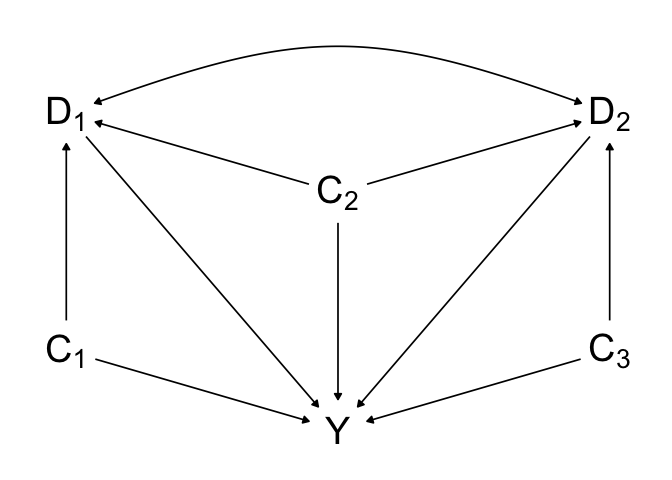
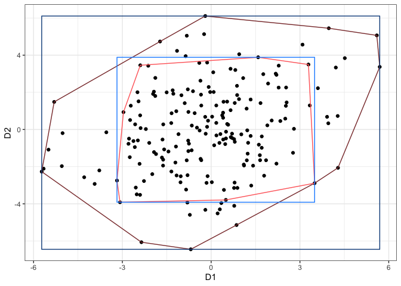

Multivariate Generalized Propensity Score (mvGPS)
================

<!-- begin badges -->

[](https://travis-ci.org/williazo/mvGPS)
[](https://codecov.io/gh/williazo/mvGPS)
<!-- end badges -->

The goal of this package is to expand currently available software to
estimate weights for multivariate continuous exposures. Weights are
formed assuming a multivariate normal distribution for the simultaneous
exposures.

# Installation

You can install `mvGPS` from GitHub using the following code:

``` r
install.packages("devtools")
devtools::install_github("williazo/mvGPS")
```

## Example

### Data Generating

To illustrate a simple setting where this multivariate generalized
propensity score would be useful, we can construct a directed acyclic
graph (DAG) with a bivariate exposure, **D**=(D<sub>1</sub>,
D<sub>2</sub>), confounded by a set **C**=(C<sub>1</sub>, C<sub>2</sub>,
C<sub>3</sub>). In this case we assume C<sub>1</sub> and C<sub>2</sub>
are associated with D<sub>1</sub>, while C<sub>2</sub> and C<sub>3</sub>
are associated with D<sub>2</sub> as shown below.



To generate this data we first draw *n*=200 samples from **C** assuming
a multivariate normal distribution with mean equal to zero, variance
equal to 1, and constant covariance of 0.1.

``` r
require(MASS)
require(matrixNormal)
set.seed(06112020)
n <- 200
C_mu <- rep(0, 3)
C_cov <- 0.1
#generating the covariance matrix of 
C_Sigma <- I(3) + ((J(3) - I(3)) * C_cov)
#drawing our observed samples
C <- MASS::mvrnorm(n, mu=C_mu, Sigma=C_Sigma)
```

Next we define our exposure as a linear function of our confounders.
Explicitly these two equations are defined as

E\[D<sub>1</sub>|**C**\]=0.5C<sub>1</sub>+C<sub>2</sub>,

E\[D<sub>2</sub>|**C**\]=0.3C<sub>2</sub>+0.75C<sub>3</sub>.

With this construction, the exposures have one confounder in common,
C<sub>2</sub>, and one independent confounder. The effect size of the
confounders vary for each exposure. We assume that the conditional
distribution of **D** given **C** is bivariate normal with conditional
correlation equal to 0.2 and conditional variance equal to 2.

``` r
s_d1_cond <- 2
s_d2_cond <- 2
s_d_cond <- c(s_d1_cond, s_d2_cond)
rho_cond <- 0.2

d1_beta <- c(0.5, 1, 0) #exposure D1 effect of C1 and C2
d2_beta <- c(0, 0.3, 0.75) #exposure D2 effect of C2 and C3
d_beta <- cbind(d1_beta, d2_beta)
d_xbeta <- C %*% d_beta #constructing the conditional mean expression
d1_xbeta <- d_xbeta[, 1]
d2_xbeta <- d_xbeta[, 2]

#construction conditional covariance matrix
D_corr_cond <- I(2) + matrix(c(0, rho_cond, rho_cond, 0), nrow=2, ncol=2, byrow=TRUE)
D_Sigma_cond <- outer(s_d_cond, s_d_cond) * D_corr_cond

#drawing bivariate exposure
D1 <- rnorm(n, d1_xbeta, s_d1_cond)
D2 <- rnorm(n, d2_xbeta + (s_d2_cond / s_d1_cond) * rho_cond * (D1 - d1_xbeta), 
            sqrt((1 - rho_cond^2) * s_d2_cond^2))
D <- cbind(D1, D2)
```

By construction our marginal correlation of D is a function of
parameters from the distribution of **C**, coefficients of conditional
mean equations, and conditional covariance parameter. For the above
specification the true marginal correlation of exposure is equal to 0.24
and our observed marginal correlation is equal to 0.26.

Finally, we specify our outcome, Y, as a linear combination of the
confounders and exposure. The mean of the dose-response equation is
shown below,

E\[Y|**D**,
**C**\]=0.75C<sub>1</sub>+1C<sub>2</sub>+0.6C<sub>3</sub>+D<sub>1</sub>+D<sub>2</sub>.

Both exposures have treatment effect sizes equal to one. The standard
deviation of our outcome is set equal 2.

``` r
alpha <- c(0.75, 1, 0.6, 1, 1)
sd_Y <- 2
X <- cbind(C, D)
Y <- X%*%alpha + rnorm(n, sd=sd_Y)
```

### Generating Weights

With the data generated, we can now use our primary function `mvGPS()`
to estimate weights. These weights are constructed such that the
numerator is equal to the marginal density, with the denominator
corresponding to the conditional density, i.e., the multivariate
generalized propensity score.


In our case since the bivariate exposure is assumed to be bivariate
normal, we can break both the numerator and denominator into full
conditional densities knowing that each univariate conditional
expression will remain normally distributed.


Notice in the equation above, we are also able to specify the
confounding set for each exposure separately.

``` r
require(mvGPS)
out_mvGPS <- mvGPS(D=D, C=list(C[, 1:2], C[, 2:3]))
w <- out_mvGPS$w
```

This vector `w` now can be used to test balance of confounders by
comparing weighted vs. unweighted correlations and to estimate the
treatment effects using weighted least squares regression.

### Balance Assessment

For continuous exposure(s) we can asses balance using several metrics
such as euclidean distance, maximum absolute correlation, and average
absolute correlation where correlation refers to the Pearson correlation
between exposure and covariate.

Below we use the function `bal()` to specify a set of potential models
to use for comparison. Possible models that are available include:
mvGPS, Entropy, CBPS, GBM, and PS. For methods other than mvGPS which
can only estimate univariate continuous exposure, each exposure is fit
separately so that weights are generated for both exposures.

``` r
require(knitr)
bal_results <- bal(model_list=c("mvGPS", "entropy", "CBPS", "PS", "GBM"), D, C=list(C[, 1:2], C[, 2:3]))
bal_summary <- bal_results$bal_metrics 
#contains overall summary statistics with respect to balance
bal_summary <-data.frame(bal_summary, ESS=c(bal_results$ess, nrow(D)))
#adding in ESS with last value representing the unweighted case
bal_summary <- bal_summary[order(bal_summary$max_cor), ]

kable(bal_summary[, c("euc_dist", "max_cor", "avg_cor", "ESS", "method")], 
      digits=4, row.names=FALSE, 
      col.names=c("Euc. Distance", "Max. Abs. Corr.", 
                  "Avg. Abs. Corr.", "ESS", "Method"))
```

<table>

<thead>

<tr>

<th style="text-align:right;">

Euc. Distance

</th>

<th style="text-align:right;">

Max. Abs. Corr.

</th>

<th style="text-align:right;">

Avg. Abs. Corr.

</th>

<th style="text-align:right;">

ESS

</th>

<th style="text-align:left;">

Method

</th>

</tr>

</thead>

<tbody>

<tr>

<td style="text-align:right;">

0.0930

</td>

<td style="text-align:right;">

0.0884

</td>

<td style="text-align:right;">

0.0331

</td>

<td style="text-align:right;">

163.8253

</td>

<td style="text-align:left;">

mvGPS

</td>

</tr>

<tr>

<td style="text-align:right;">

0.2142

</td>

<td style="text-align:right;">

0.2044

</td>

<td style="text-align:right;">

0.0672

</td>

<td style="text-align:right;">

161.8505

</td>

<td style="text-align:left;">

CBPS\_D1

</td>

</tr>

<tr>

<td style="text-align:right;">

0.2568

</td>

<td style="text-align:right;">

0.2145

</td>

<td style="text-align:right;">

0.1137

</td>

<td style="text-align:right;">

159.9284

</td>

<td style="text-align:left;">

GBM\_D1

</td>

</tr>

<tr>

<td style="text-align:right;">

0.2592

</td>

<td style="text-align:right;">

0.2288

</td>

<td style="text-align:right;">

0.1085

</td>

<td style="text-align:right;">

179.8179

</td>

<td style="text-align:left;">

PS\_D1

</td>

</tr>

<tr>

<td style="text-align:right;">

0.3095

</td>

<td style="text-align:right;">

0.2321

</td>

<td style="text-align:right;">

0.1092

</td>

<td style="text-align:right;">

178.8683

</td>

<td style="text-align:left;">

entropy\_D2

</td>

</tr>

<tr>

<td style="text-align:right;">

0.2400

</td>

<td style="text-align:right;">

0.2336

</td>

<td style="text-align:right;">

0.0721

</td>

<td style="text-align:right;">

172.2635

</td>

<td style="text-align:left;">

entropy\_D1

</td>

</tr>

<tr>

<td style="text-align:right;">

0.3121

</td>

<td style="text-align:right;">

0.2403

</td>

<td style="text-align:right;">

0.1099

</td>

<td style="text-align:right;">

173.4609

</td>

<td style="text-align:left;">

CBPS\_D2

</td>

</tr>

<tr>

<td style="text-align:right;">

0.3185

</td>

<td style="text-align:right;">

0.2418

</td>

<td style="text-align:right;">

0.1227

</td>

<td style="text-align:right;">

180.3586

</td>

<td style="text-align:left;">

PS\_D2

</td>

</tr>

<tr>

<td style="text-align:right;">

0.3285

</td>

<td style="text-align:right;">

0.2502

</td>

<td style="text-align:right;">

0.1219

</td>

<td style="text-align:right;">

142.8799

</td>

<td style="text-align:left;">

GBM\_D2

</td>

</tr>

<tr>

<td style="text-align:right;">

0.5009

</td>

<td style="text-align:right;">

0.3168

</td>

<td style="text-align:right;">

0.2421

</td>

<td style="text-align:right;">

200.0000

</td>

<td style="text-align:left;">

unweighted

</td>

</tr>

</tbody>

</table>

We can see that our method `mvGPS` achieves the best balance across both
exposure dimensions. In this case we can also note that the effective
sample size after weighting 163.8253 is still sufficiently large that we
not worried about loss of power.

<!-- To further examine how the individual confounders are balanced for each method -->

<!-- we can plot their Pearson correlations as shown in the interactive plot below. -->

<!-- ```{r 3dbalance, warning=FALSE, message=FALSE, echo=FALSE} -->

<!-- require(plotly) -->

<!-- require(stringr) -->

<!-- require(tidyr) -->

<!-- cor_list <- bal_results$cor_list -->

<!-- cor_df <- data.frame(cor=unlist(cor_list, recursive=TRUE)) -->

<!-- cor_df$desc <- row.names(cor_df) -->

<!-- desc_split <- str_split(cor_df$desc, "\\.") -->

<!-- method <- unlist(lapply(desc_split, function(x) x[[1]])) -->

<!-- exp <- unlist(lapply(desc_split, function(x) gsub("_cor", "", x[[2]]))) -->

<!-- confounder <- unlist(lapply(desc_split, function(x) paste0("C", x[[3]]))) -->

<!-- cor_df <- data.frame(cor_df, method=method, exp=exp, confounder=confounder) -->

<!-- cor_df_wide <- pivot_wider(cor_df[, c("cor", "method", "exp", "confounder")], -->

<!--                            id_cols=c("method", "confounder"), names_from="exp", -->

<!--                            values_from="cor") -->

<!-- cor_df_wide[is.na(cor_df_wide)] <- 0 -->

<!-- #setting covariates that were not used for one exposure to 0 by default so that  -->

<!-- #they appear in the plot -->

<!-- fig <- plot_ly(data=subset(cor_df_wide, method=="mvGPS"), x=~D1, y=~D2, z=~confounder, color=~method, -->

<!--         marker=list(size=5), type="scatter3d", mode="markers+lines",  -->

<!--         hovertemplate = paste('<i>D1 Pearson Correlation</i>: %{x:.4f}', -->

<!--                               '<br><i>D2 Pearson Correlation</i>: %{y:.4f}', -->

<!--                               '<br><b>Covariate</b>: %{z}')) %>% -->

<!--     add_trace(data=subset(cor_df_wide, method=="unweighted")) %>% -->

<!--     add_trace(data=subset(cor_df_wide, !method%in%c("unweighted", "mvGPS")), -->

<!--               visible="legendonly") %>% -->

<!--     layout(title=list(text="Covariate Balancing"), -->

<!--                scene = list(xaxis = list(title="D1-Covariate Correlation", text="D1"), -->

<!--                             yaxis = list(title="D2-Covariate Correlation", text="D2"), -->

<!--                             zaxis = list(title="Covariates"))) -->

<!-- htmlwidgets::saveWidget(partial_bundle(fig), file=file.path(getwd(), "README_files/cov_balance.html")) -->

<!-- ``` -->

### Bias Reduction

Finally, we want to check that these weights are properly reducing the
bias when we estimate the exposure treatment effect. To do this we will
use the function. To do this we can construct a weighted least squares
regression.

``` r
dt <- data.frame(Y, D, w=w)
#using mvGPS weights
wls_mod <- lm(Y ~ D1 + D2, weights=w, data=dt)
mvGPS_tx_hat <- coef(wls_mod)[c("D1", "D2")]

#unadjusted estimates for treatment effects
unadj_mod <- lm(Y ~ D1 + D2, data=dt)
unadj_tx_hat <- coef(unadj_mod)[c("D1", "D2")]

bias_tbl <- cbind(truth=c(1, 1), mvGPS=mvGPS_tx_hat, unadj=unadj_tx_hat)
kable(bias_tbl, digits=2, row.names=TRUE, 
             col.names=c("Truth", "mvGPS", "Unadjusted"))
```

<table>

<thead>

<tr>

<th style="text-align:left;">

</th>

<th style="text-align:right;">

Truth

</th>

<th style="text-align:right;">

mvGPS

</th>

<th style="text-align:right;">

Unadjusted

</th>

</tr>

</thead>

<tbody>

<tr>

<td style="text-align:left;">

D1

</td>

<td style="text-align:right;">

1

</td>

<td style="text-align:right;">

1.12

</td>

<td style="text-align:right;">

1.28

</td>

</tr>

<tr>

<td style="text-align:left;">

D2

</td>

<td style="text-align:right;">

1

</td>

<td style="text-align:right;">

1.05

</td>

<td style="text-align:right;">

1.18

</td>

</tr>

</tbody>

</table>

To compare the total reduction at bias we look at the total absolute
bias where we see mvGPS has total bias equal to 0.18, or an average
percent bias of 8.79% per exposure, compared to unadjusted total bias
equal to 0.45, or an average percent bias of 22.62% per exposure. We
therefore achieve 2.57 times reduction in bias.

### Defining Estimable Region

An important consideration when using propensity scores to estimate
causal effects are the three key identifying assumptions:

1.  weak ignorability, aka, unconfoundedness, aka, selection on
    observables
2.  stable unit treatment value (SUTVA)
3.  positivity

*Weak ignorability* assumes that the exposure is conditionally
independent of the potential outcomes given the appropriate set of
confounders. Checking balance as shown above is one of the key
diagnostics to determining the legitimacy of this assumption in
practice.

*SUTVA* states that the potential outcome of each unit does not depend
on the exposure that other units receive and that there exists only one
version of each exposure. It is generally an untestable assumption, but
is key to ensuring that the potential outcomes are well-defined and that
the observed outcome given the observed exposure corresponds to the true
potential outcome.

The final identifying assumption, *positivity*, is our focus when
defining estimable regions for multivariate exposure. Positivity posits
that all units have the potential to receive a particular level of
exposure given any value of the confounders. The upshot of this is that
we need to take care when defining the domain of our exposure when
estimating the mvGPS.

Typically in the case of univariate continuous exposure, we often ensure
positivity by restricting the domain to the observed range of exposure
or a trimmed version. A logical extension to the multivariate exposure
would be to define our domain as the product of the range of each
exposure. However, when the exposures of interest are correlated this
domain may not be appropriate. Recall that in our simulated data the
marginal correlation of D<sub>1</sub> and D<sub>2</sub> is 0.26.

Instead, we propose to ensure positivity with multivariate exposures by
defining the domain as the multidimensional convex hull of the observed
exposure values. To obtain the convex hull of our exposure we use the
function `hull_sample()`. This will return the vertices of the convex
hull, and in the case of bivariate exposure it will also sample equally
along a grid of the convex hull and return these values which can be
used for calculating the dose-response surface.

Note that we can also create trimmed versions of either the product of
ranges or convex hull as shown below.

``` r
require(sp)
chull_D <- hull_sample(D) 
#generate convex hull of exposure
chull_D_trim <- hull_sample(D, trim_hull=TRUE, trim_quantile=0.95)
#generate trimmed convex hull

bbox_grid <- sp::bbox(chull_D$hpts_vs) #bounding box over convex hull
bbox_df <- data.frame(D1=c(bbox_grid[1, 1], bbox_grid[1, 2], 
                           bbox_grid[1, 2], bbox_grid[1, 1]), 
                      D2=c(bbox_grid[2, 1], bbox_grid[2, 1], 
                           bbox_grid[2, 2], bbox_grid[2, 2]))
bbox_grid_trim <- sp::bbox(chull_D_trim$hpts_vs) #bounding box over trimmed convex hull
bbox_df_trim <- data.frame(D1=c(bbox_grid_trim[1, 1], bbox_grid_trim[1, 2],
                                bbox_grid_trim[1, 2], bbox_grid_trim[1, 1]), 
                           D2=c(bbox_grid_trim[2, 1], bbox_grid_trim[2, 1], 
                                bbox_grid_trim[2, 2], bbox_grid_trim[2, 2]))
chull_plot <- ggplot(data=data.frame(D), aes(x=D1, D2))+
    geom_point()+
    geom_polygon(data=data.frame(chull_D$hpts_vs), color="indianred4", fill=NA)+
    geom_polygon(data=data.frame(chull_D_trim$hpts_vs), color="indianred1", fill=NA, alpha=0.4)+
    geom_polygon(data=bbox_df, color="dodgerblue4", fill=NA)+
    geom_polygon(data=bbox_df_trim, color="dodgerblue1", fill=NA, alpha=0.4)+
    xlab("D1")+
    ylab("D2")+
    theme_bw()
chull_plot
```



In dark red we have the observed convex hull and in light red we have
the trimmed convex hull at the 95th percentile. In dark blue we have the
observed product range and in light blue we have the trimmed product
range at the 95th percentile.

Notice that by trimming we are further restricting our domains to high
density regions of the exposure. We can also see that by restricting to
the convex hull we are avoiding areas with sparse data that are included
in the product range domain.

### Dose-Response Surface

When exposure is bivariate, the resulting dose-response function is a
surface. Using the weighted regression model described above to
incorporate the weights, we can predict across our convex hull domain to
gain intuition about how altering the exposures effects the outcome of
interest. To see an example of this type of dose-response surface on an
application to analyzing obesity intervention programs in Los Angeles
County visit <https://williazo.github.io/resources/>.
